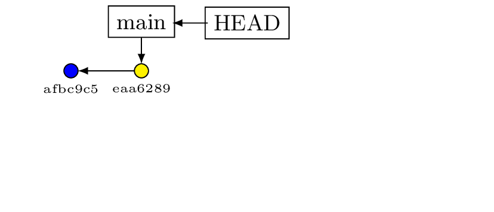

# Lokales Arbeiten {#lokale_arbeit}

## Clients

:::{.fragment .definition-row}
[Zum Lernen:]{.def-20p-bold} 
[Kommandozeile *git-Bash*]{.def-80p}
:::

::: {.fragment .definition-row}
[Später:]{.def-20p-bold} 
[Client nach Wahl]{.def-80p}

:::{.smaller .inset}
* Gitkraken
* GitEye
* VsCode
* IntelliJ
* ...
:::
:::

::: {.notes}

* git wurde ursprünglich für die Bash konzipiert
* grapfische Clients *verbiegen* manche Abläufe.  
  Nicht schlecht, aber nicht universell bei Wechsel des Systems
* Zuerst git-Bash. Eine Form von Mini-Linux für Windows
* LSW ansprechen
:::

---

### git-Bash

::: {.fragment}
#### Download
:::{.inset}
[https://git-scm.com/install/windows](https://git-scm.com/install/windows){preview-link="true"}
:::
:::

:::{.notes}
* Seite anklicken und gemeinsam runterladen
* Installation durchführen
* Details sind auf der nächsten Folie
:::


---

#### Einzig wichtige Stellen

<iframe src="material/installation/install_doku.pdf" width="100%" height="600px"></iframe>


:::{.notes}
* Durchklicken
* Einige wichige Stellen besprechen
:::

---

### Konfiguration von Git

::: fragment
``` bash
# Eingabe
git config --list

# Ausgabe
user.email=
user.name=
...
```

Variablen setzen

:::

::: fragment
``` bash
git config --global user.name="Susi Sandmann"
git config --global user.email="susi@sandmann.de"
```
:::


:::{.notes}
* Varianten, wie man ins Terminal kommt
* Noch keine Pfad-Navigation in der Shell!
:::


---

### Repository anlegen

::::::: columns
:::: column
::: fragment
[Variante 1]{.smaller}
``` bash
mkdir versuch_1
cd versuch_1
git init
```
:::
::::

:::: column
::: fragment
[Variante 2]{.smaller}
``` bash
git init versuch_1
cd versuch_1
```
:::
::::
:::::::

::: fragment
Umbenennen

``` bash
git branch -m main 
```
:::
:::{.fragment}
[Global änderbar]{.smaller}
```bash
git config --global init.defaultBranch main
```
:::

:::{.notes}
* Einen Ordner mit Namen *GITKURS* aus dem Explorer heraus erstellen
* Über RMT das Terminal öffnen
* Die Befehle erklären, aber nicht mehr -> Linux kommt gleich
:::

# Linux - Grundlagen

Das Übungsblatt befindet sich in den Materialien.

# Arbeiten mit Git

## Einfacher Workflow

::: fragment
Inhalt erstellen
:::

::: fragment
``` bash
echo "Version 1" > datei1.txt
```
:::

::: fragment
Datei aufnehmen
:::

::: fragment
``` bash
git add datei1.txt
```
:::

::: fragment
Datei versionieren
:::

::: fragment
``` bash
git commit -m "Erste Datei erstellt"
```
:::

:::{.notes}
* echo ist ein weiterer Bash-Befehl
* `>` vs. `>>`
* typischer Workflow von git
* hier könnten wir den Workshop beenden :)
:::

---

Erweitern der Datei

::: fragment
``` bash
echo "Version 2" >> datei1.txt
git add datei1.txt
git commit -m "Erläuterung"
```
:::

::: fragment
Was ist passiert?

``` bash
git log --oneline  # auch ohne --oneline probieren!
# Ausgabe
eaa6289 (HEAD -> main) Erläuterung
afbc9c5 Erste Datei erstellt
```
:::

::: {.fragment}

:::

:::{.notes}
* Wir erweitern die Datei
* Wir lernen das Protokoll von git kennen (log)
* Testen lassen mit / ohne oneline
* Hash thematisieren
* Hashes sehen wir noch genauer an
* HEAD -> main als Pointer
:::

---

### Varianten von *add*

::: fragment
```bash
git add <dateiname> # Einzelne Datei
```
:::

<br>

::: fragment
```bash
git add . # Alle Dateien im aktuellen Ordner 
          # und den Unterordnern
```
:::

<br>

::: fragment
```bash
git add --all # (oder -A) fügt alle Dateien 
              # ab der obersten Ebene des Projekts hinzu
```
:::

:::{.notes}
Varianten von add
:::

---

### Ausschließen von Dateien

::: {.fragment}
[Anlegen von *.gitignore*]{.smaller}
```bash
nano .gitignore 
```
:::

::: {.fragment}
[Inhalt von *.gitignore* (evtl. verborgene Dateien im Exlorer anzeigen lassen)]{.smaller}

``` bash
*.log
*.tmp
```
:::

::: {.fragment}
[Git arbeitet dateibasiert und ignoriert leere Ordner.]{.smaller}
:::

::: {.fragment}
[Eine Datei *.gitkeep* erzwingt Versionierung "leere" Ordner]{.smaller}

``` bash
mkdir material
cd material
touch .gitkeep 
```
:::

:::{.notes}
* Was sind Wildcards?
* Wie speichert man in nano
* Datei mit ls suchen => ls -a
* gitkeep
:::