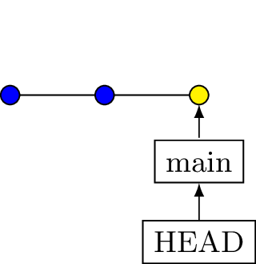
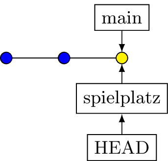
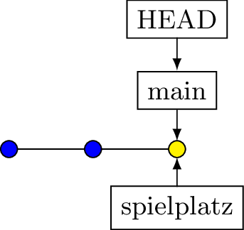

# Branches {#merge}

(Abzweigungen bei der Entwicklung)

---

**Erstellen eines Branchs**

```bash
git switch -c spielplatz
```

::: {.fragment}
[Erstellt einen Zeiger *spielplatz* auf den aktuellen Commit.]{.smaller}
:::


::: columns 
::: column 
::: {.fragment}
Davor  

:::

:::
::: column 
::: {.fragment}
Danach  

:::
:::
:::

:::{.notes}
Auch andere Befehle in älteren Anleitungen (checkout)  
Wegen Verwirrung geändert.

Branch = Zeiger -- BILDER

:::

---

### Praxis

::: columns 
::: {.column width="50%"}
::: {.fragment }
```bash 
cd /tmp
rm -rf branch_lab

git init branch_lab
cd branch_lab 
git branch -m main

echo "Zeile 1" > datei.txt 
git add .
git commit -m "Datei 1 erstellt"

git log --oneline
```
:::
:::

::: {.column width="50%"} 
::: {.fragment}
```{.bash .smaller}
0e468ef (HEAD -> main) Datei 1 erstellt
```
:::
:::
:::

:::{.notes}
Nächstes Repo „branch_lab“  
Eine Datei füllen und committen  
Log ansehen (HEAD->main) als Pointer
:::

---

### Ein Blick in Git

::: columns
::: column 
::: {.fragment}
```bash
.git
├── branches
├── COMMIT_EDITMSG
├── config
├── description
├── HEAD
├── hooks
│   ├── applypatch-msg.sample
│   ├── commit-msg.sample
│   ├── fsmonitor-watchman.sample
│   ├── post-update.sample
│   ├── pre-applypatch.sample
│   ├── pre-commit.sample
│   ├── pre-merge-commit.sample
│   ├── prepare-commit-msg.sample
│   ├── pre-push.sample
│   ├── pre-rebase.sample
│   ├── pre-receive.sample
│   ├── push-to-checkout.sample
│   ├── sendemail-validate.sample
│   └── update.sample
├── index
├── info
│   └── exclude
├── logs
│   ├── HEAD
│   └── refs
│       └── heads
│           └── main
├── objects
│   ├── 23
│   │   └── bc85c5557f20ae6530d2ad0e66dd9d42ad225d
│   ├── 4d
│   │   └── 5819dc3711611c3e6a16b1ed362a6952e980fc
│   ├── b1
│   │   └── 367440191d3abc86bb46f955d140fec7eef42a
│   ├── info
│   └── pack
└── refs
    ├── heads
    │   └── main
    └── tags
```
:::
:::

::: column 
::: {.fragment}
```bash
cat .git/refs/heads/main

# Ausgabe
23bc85c5557f20ae6530d2ad0e66dd9d42ad225d
```
:::

::: {.fragment}
Inhalt von HEAD bleibt,   
Inhalt von *main* ändert sich.
:::
:::

:::

:::{.notes}
Die Datei HEAD zeigt auf refs/heads/main  
Die enthält den Hash vom Commit
:::

---

Mehr Inhalt

::: columns
::: column 
::: {.fragment}
```bash
echo "Zeile 2" >> datei.txt 
git add . && git commit -m "Zeile 2"

git log --oneline  # HEAD->main

echo "Zeile 3" >> datei.txt 
git add . && git commit -m "Zeile 3"

git log --oneline  # HEAD->main
```
:::
:::

::: column 
::: {.fragment}
```bash
e049cba (HEAD -> main) Zeile 2
23bc85c Datei 1 erstellt
[main 35473c0] Zeile 3
 1 file changed, 1 insertion(+)
35473c0 (HEAD -> main) Zeile 3
e049cba Zeile 2
23bc85c Datei 1 erstellt
```

:::
:::

:::


::: notes
&& oder ; ? Unterschied erklären
exit 0
Der Zeiger rutscht von Commit zu Commit
:::

---

Branch *spielplatz* erstellen

```bash
git switch -c spielplatz
git log --oneline  # HEAD -> spielplatz, main
```

Den Zeiger *spielplatz* erstellen, Zeiger HEAD positionieren


::: notes
Branch Spielplatz erstellen  - HEAD!
Die aktuelle Branchposition ist in gitk schlecht zu sehen
:::

---

Zurück zu Branch *main*

```bash
git switch main
git log --oneline  # HEAD -> main, spielplatz
```

Der Zeiger HEAD wechselt die Position zu *main*



::: notes
Wieder HEAD-Wechsel beobachtbar
:::

---

## Verfolgen in GIT


::: columns
::: column 
::: {.fragment}
Branch erstellt
```bash
cat .git/HEAD

# Ausgabe
ref: refs/heads/spielplatz
```
:::
:::

::: column 
::: {.fragment}
Noch ist der Stand gleich:

```bash
cat .git/refs/heads/spielplatz
35473c01000d9323569132c2b915750d5b2cfd29

cat .git/refs/heads/main
35473c01000d9323569132c2b915750d5b2cfd29
```
:::
:::
:::

::: {.notes}
Einen Commit auf Spielplatz drauf setzen und ausgeben lassen
:::

::: notes
Im Tree beobachtbar  
Aktueller Stand der refs identisch  
Pointer auf gleichen Commit
:::

---

## Verfolgen in GIT


::: columns
::: column 
::: {.fragment}
Einen Commit mehr
```bash
echo "Test" >> test.txt
git add . 
git commit -m "test"
```
:::
:::

::: column 
::: {.fragment}
Nun sieht es anders aus:

```bash
cat .git/refs/heads/spielplatz
8abcd48a5bec41d5a147cf70b8b9f005422db862

cat .git/refs/heads/main
35473c01000d9323569132c2b915750d5b2cfd29
```
:::
:::
:::


::: notes
Neuer Commit ändert das
:::


## Zusammenführung

**Einfachster Fall**  

::: columns
::: column
::: {.fragment}
Nur Änderungen in Spielplatz ...

::: {style="width: 80%;"}

:::

:::
:::

::: column 
::: {.fragment}

Nur verschieben des Zeigers
 
::: {style="width: 80%;"}

:::

:::
:::
:::

::: {.notes}
Hier spult git einfach vor und setzt den Pointer vor.
Mehr kommt später!
:::

