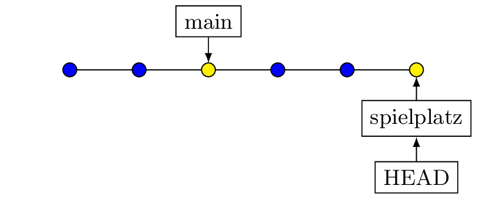
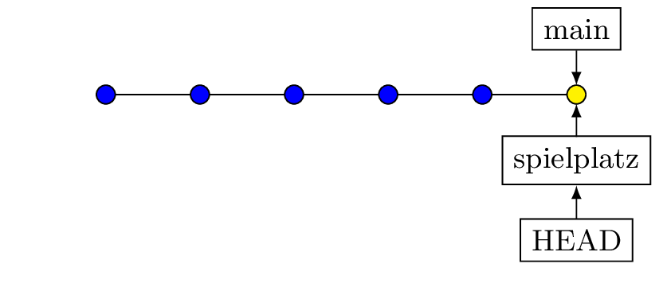
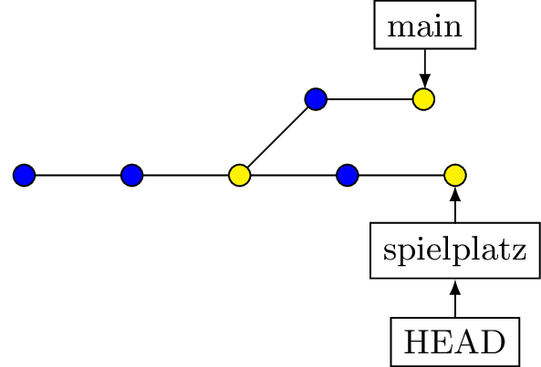
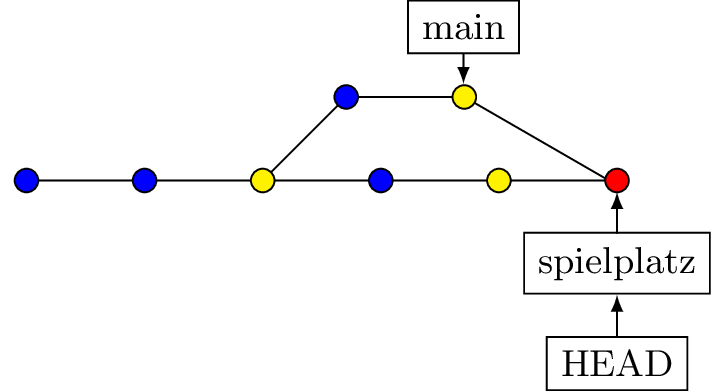
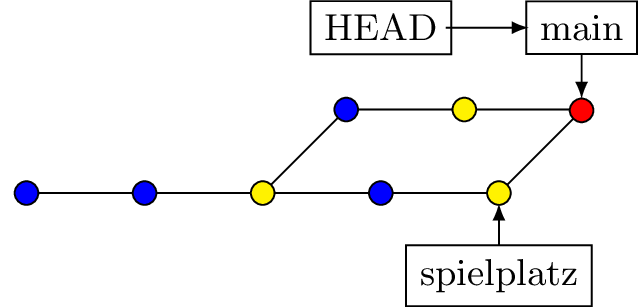

# Merge{#merge_2}

## Fast-Forward

Verschiebt nur den Branchpointer

::: columns 
::: column
{style="width: 80%;"}
:::

::: column
{style="width: 80%;"}
:::
:::

## Merge-Commit
(3 Way Merge)

Änderungen in beiden Branches werden   
in einem Commit zusammengeführt.

::: {.r-stack}
{.fragment .absolute top=50px; left=750px; width=400 }

{.fragment  .absolute top=400px; left=10px; width=500}

{.fragment  .absolute top=380px; left=700px; width=500}
:::

::: {.fragment}
[Nicht alle Pointer werden versetzt!]{.left-middle .alert}
:::

----

Löschen eines Branches

```bash
git branch -d <branch-name>
```

::: columns
::: column 
::: {.fragment}
```bash
*   863d5e5 (HEAD -> main) Merge commit
|\  
| * 314ac8e (entwicklung) schritt 6
| * 7525adc schritt 5
| * 9a0347f schritt 4
* | 3e61d7a schritt 7
|/  
* 0eaa7bb schritt 3
* 2bd1f7f schritt 2
* 7390c71 schritt 1
```
:::
:::

::: column 
::: {.fragment}
```bash
*   863d5e5 (HEAD -> main) Merge commit
|\  
| * 314ac8e schritt 6 << fehlt
| * 7525adc schritt 5
| * 9a0347f schritt 4
* | 3e61d7a schritt 7
|/  
* 0eaa7bb schritt 3
* 2bd1f7f schritt 2
* 7390c71 schritt 1
```
:::
:::
:::
