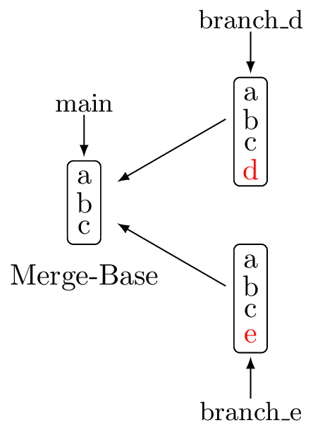
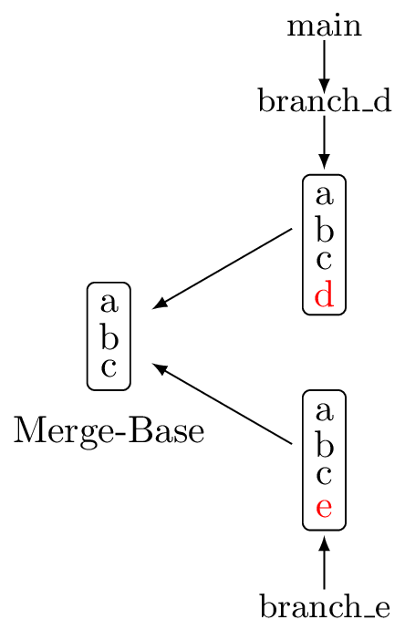

# Nicht so einfach

---

## Merge-Base

::: {.fragment}
Ein Merge *vergleicht nicht* Branches! 
:::

::: {.fragment}
Es werden *diff*s bezüglich der Merge-Base erstellt.
:::

---

### Beispiel

#### Situation  

::: {.columns}
::: {.column}
{width="50%"}
:::
::: {.column}
Merge von branch_d auf main  

::: {.fragment}
```bash
git diff main branch_d 
```
:::
::: {.fragment .smaller}
Fast Forward möglich
:::
::: {.fragment .smaller}
Nur Pointer *main* verschieben.
:::
::: {.fragment .smaller}
Diff zur Merge-Base liefert einfach *+d*
:::
:::
:::

---

Danach

::: {.columns}
::: {.column}
{width="50%"}
:::
::: {.column}
Merge von *branch_e* auf main
```bash
merge branch_e
```
::: {.fragment .smaller}
Ein Diff zur Merge-Base liefert
:::
::: {.fragment .smaller}
vom *main*: +d  
von *branch_e*: +e
:::
::: {.fragment .smaller}
Konflikt!
:::
:::
:::
<!-- end columns -->