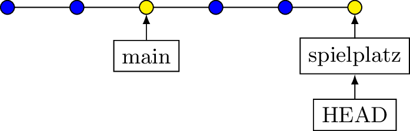

# Merge

## Fast-Forward

Verschiebt nur den Branchpointer

{style="width: 60%;"}
{style="width: 60%;"}

## Merge-Commit
(3 Way Merge)

Änderungen in beiden Branches werden in einem Commit 
zusammengeführt.

Kein Versetzen der Branch-Pointer

BILD 1

----

Oder so 


BILD 2

----

Löschen eines Branches

```bash
git branch -d <branch-name>
```

::: columns
::: column 
::: {.fragment}
```bash
*   863d5e5 (HEAD -> main) Merge commit
|\  
| * 314ac8e (entwicklung) schritt 6
| * 7525adc schritt 5
| * 9a0347f schritt 4
* | 3e61d7a schritt 7
|/  
* 0eaa7bb schritt 3
* 2bd1f7f schritt 2
* 7390c71 schritt 1
```
:::
:::

::: column 
::: {.fragment}
```bash
*   863d5e5 (HEAD -> main) Merge commit
|\  
| * 314ac8e schritt 6 << fehlt
| * 7525adc schritt 5
| * 9a0347f schritt 4
* | 3e61d7a schritt 7
|/  
* 0eaa7bb schritt 3
* 2bd1f7f schritt 2
* 7390c71 schritt 1
```
:::
:::
:::

## Rebase

Alternative zu Merge

::: columns
::: column 
::: {.fragment}
```bash
* b6a0d9a (entwicklung) schritt 6
* 0228600 schritt 5
* e3ff39d schritt 4
| * db10da8 (HEAD -> main) schritt 8
| * 8db8cde schritt 7
|/  
* 58ebec4 schritt 3
* 9790fb5 schritt 2
* 5db40d9 schritt 1
```
:::
:::

::: columns 
::: {.fragment}
* 9fa3c20 (HEAD -> entwicklung) schritt 6
* a775571 schritt 5
* 07c3941 schritt 4
* db10da8 (main) schritt 8
* 8db8cde schritt 7
* 58ebec4 schritt 3
* 9790fb5 schritt 2
* 5db40d9 schritt 1
:::
:::
:::

::: {.notes}
Um main wieder an die Spitze zu setzen,
geht ein merge oder ein reset hard
:::

---

BILD rebase 2

---

Squash

* Eine Methode, um mehrere Commits zu bündeln.  
* Nur ein Parameter zu Rebase (-i)

---

**Beispiel**

```bash
cd /tmp

if [ -d squashlab ]; then
  echo Lösche Squashlab
  rm -rf squashlab
fi 

git init squashlab
cd squashlab
git branch -m main

for i in {1..10}
do
   echo "zeile $i" > hauptdatei.txt
git add . hauptdatei.txt
git commit -m "zeile $i"
done
```

---

**Im Repository**  

```bash
git rebase -i HEAD~5 # letzte 5

# Ausgabe 
pick 8df0f56 zeile 6
pick 73f794a zeile 7     # Für squash: pick -> s 
pick b58c055 zeile 8
pick ed9189c zeile 9
pick d67b7a7 zeile 10

# Rebase von 78da8e5..d67b7a7 auf 78da8e5 (5 Kommandos)
...
```

Es folgt ein Merge.

---


